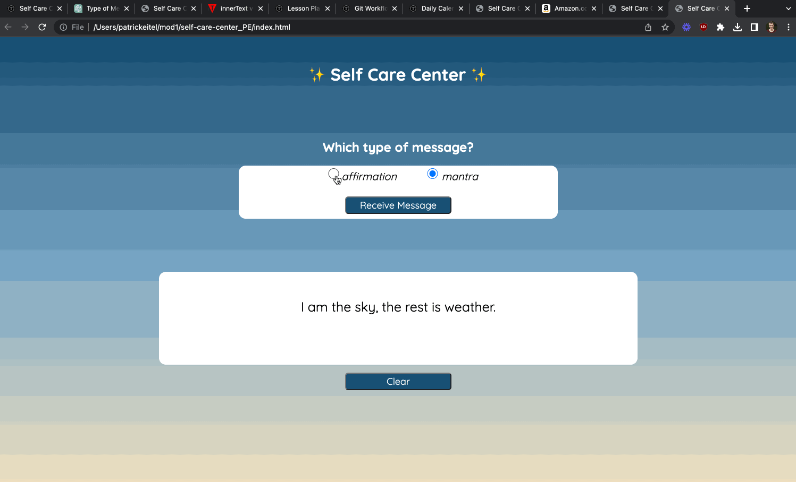

# Self-Care Center 

### Abstract:

This is a motivational website that will display the users choice of random mantras and / or words of affirmation.

### Installation Instructions:

1. Click this link: https://github.com/pitter3/self-care-center_PE
2. Click the green < code > button.
3. Copy SSH to your clipboard.
4. Open up the terminal.
5. Change into the directory you wish to clone the app into with the cd command.
6. Use the git clone command followed by pasting the copied SSH key.
7. Change into the cloned directory with the cd command.
8. Run open index.html.
9. Enjoy!

### Preview of App:

### Context:

I worked on this project intermittently over 4 days, an estimated 10 hours of time was spent on this project. I am on my third week of Mod 1 at Turing School of Software & Design!

### Contributors:

[Patrick Eitel](https://github.com/pitter3).

### Learning Goals:
The learning goals of this project are to gauge my skills in using CSS, HTML, and JavaScript to create a website from scratch. 

Tech used: MacBook Pro, Git, GitHub, VSCode, MacOS

### Wins + Challenges:

Win 1: Using a data model properly to help my overall workflow and make coding much easier.

Win 2: Everything runs as expected, bug free, with my CYOA fully implemented.

Win 3: Code is much cleaner overall than my last project, my new understanding of the Git workflow helped immensely in this regard.

Challenges: Getting CSS to behave the way I wanted was a bit of a challenge since I had just recently learned it. I overcame this by researching and utilizing tricks (such as applying green borders) taught to me by my instructors. Flexboxes were a bit tricky as well as my CSS was already setup before I even knew what a flexbox was, I added a few to learn how to use them, and learned more about them as I progressed through the project.
