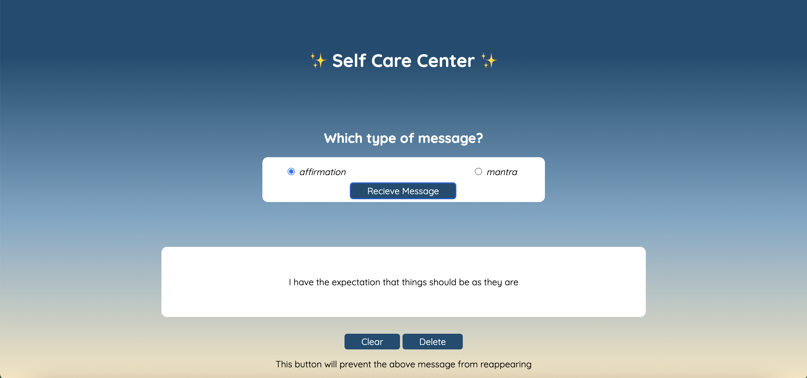

# Self-Care Center 

### Abstract:
[//]: <> (Briefly describe what you built and its features. What problem is the app solving? How does this application solve that problem?)
Self Care Center is an application that provides the visitor with randomly-generated phrases that remind them of their inherent self worth and provide them with the means of positive self-empowerment through mindfulness. The visitor can recieve a randomly generated message from either an affirmation or mantra list. They can delete a message to prevent it from reappearing during the session. The user can decide to clear the message area and have the page reset to the original view as well. 

### Installation Instructions:
[//]: <> 
1. Fork this repository
2. Clone down it down to your local machine
3. Nagivate into the directory
4. Run `open index.html` on the command line to explore mindfulness in your broswer

### Preview of App:
[//]: <>
Below you can see the Delete alert message in action which lets the visitor know what the Delete button does when they hover over it. 

### Context:
[//]: <> (Give some context for the project here. How long did you have to work on it? How far into the Turing program are you?)
This project was our Mod 1, week 3 solo project. I worked on Self Care Center for about 16 hours. 

### Contributors:
[//]: <> (Who worked on this application? Link to their GitHubs.)
- Chrissy Cooper [github profile](https://github.com/chrissycooper)

### Learning Goals:
[//]: <> (What were the learning goals of this project? What tech did you work with?)
This project gave me the opportunity to flex my newly growing development muscles in a solo context. I furthered my experience builing an application from scratch that utilizes HTML, CSS, and Javascript. I manipulated HTML and CSS to match a provided design and practised using Javascript to respond to user engagement and to manage the user's experience with error handling. 

### Wins + Challenges:
[//]: <> (What are 2-3 wins you have from this project? What were some challenges you faced - and how did you get over them?)
I am very proud of the simplicity of this application. I focused on refactoring to produce DRY (don't repeat yourself) code that functions well over adding a lot of extra features. A huge win was getting some familiarity with how Flexbox in CSS interacts with other elements in an application. That being said, Flexbox was also a huge challenge. I researched and experiemented with my CSS line by line until I was able to find some balance between flex and traditional CSS elements. Another challenge was learning how to work with radio buttons in a form. I read through the MDN documentation a few times before getting a good night's sleep and then letting curiosity and exploration connect theory to practice. 
